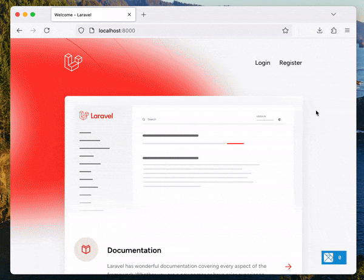

# elm-inertia-laravel-starter

Use Laravel and Elm together with Inertia.js!



### Local development

Dependency | How to check
--- | ---
[Composer v2.7.6+ and PHP v8.3.7+](https://herd.laravel.com/) | `composer -V` `php -v`
[sqlite v3.43.2+](https://sqlite.org/) | `sqlite --version`
[Node.js v20.14.0+](https://nodejs.org/) | `node -v`

```sh
# Install PHP and Node dependencies
composer install
npm install

# Run the server at http://localhost:8000
npm run dev
```
